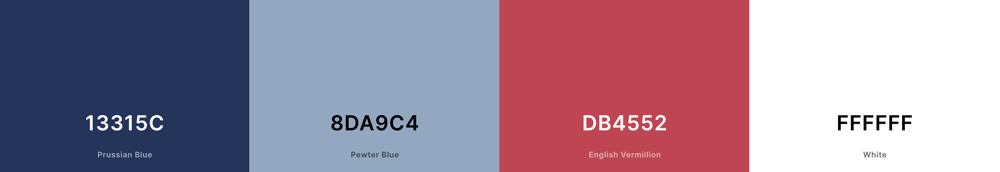
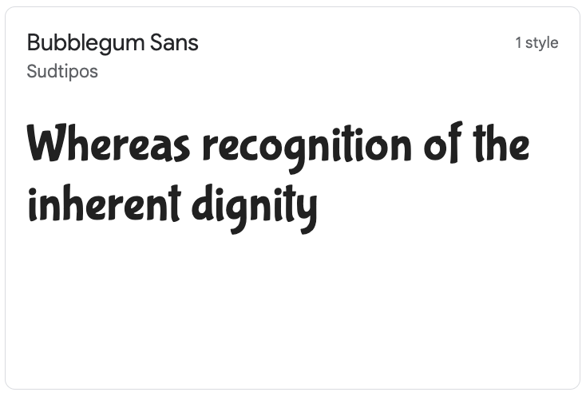
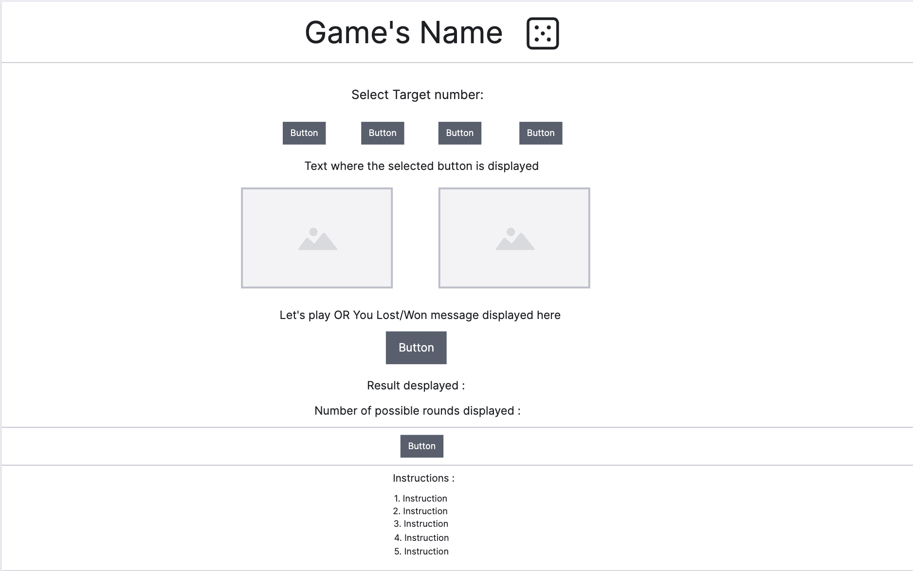
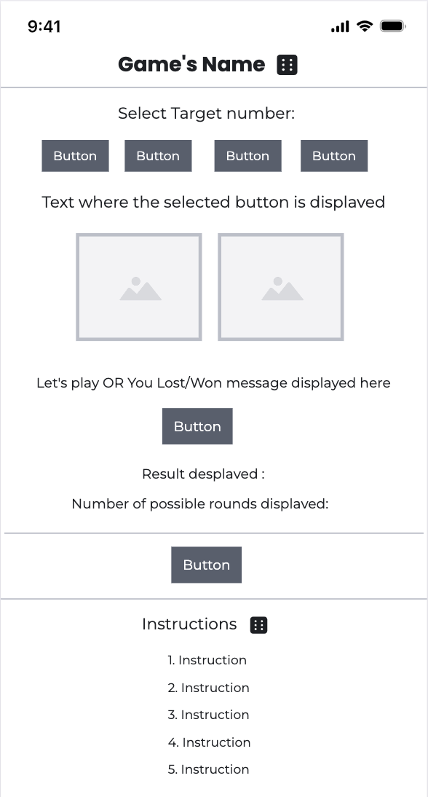
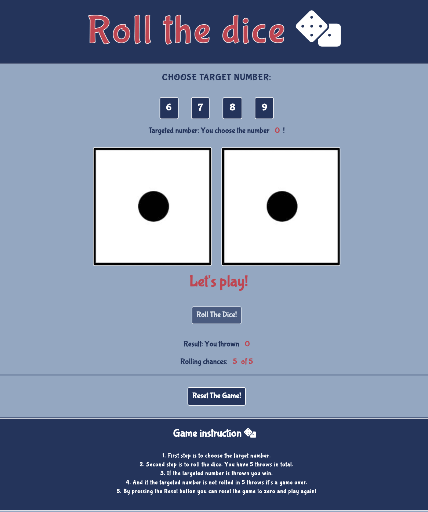
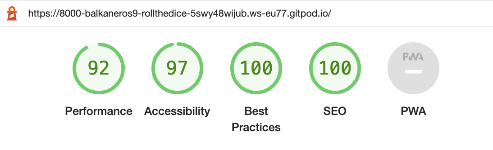
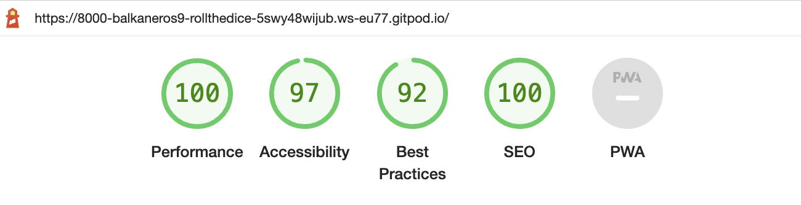
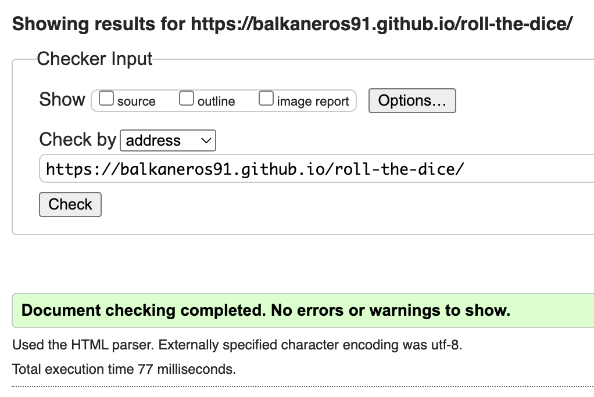
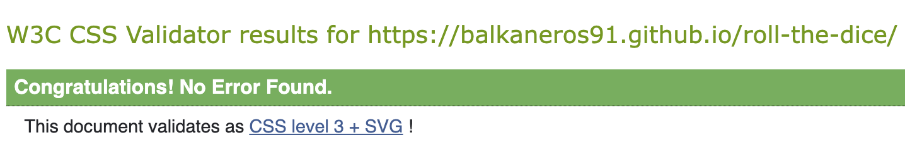
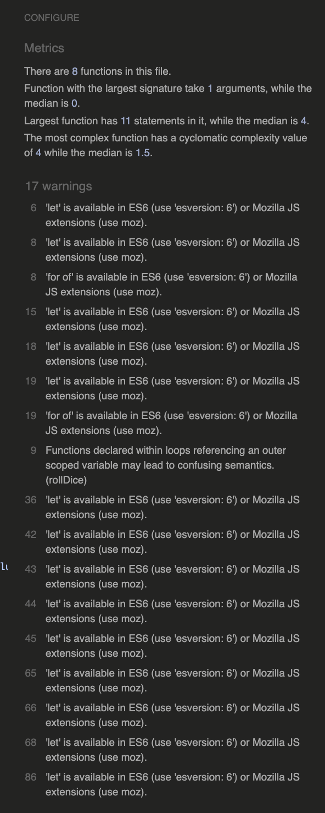

# Roll the dice!

Roll the dice! is an easy and fun game for everyone. I came up with an idea while I was attending a beginner course in programming online. The program was built of three parts: HTML, CSS, and JavaScript. The first two I finished successfully but unfortunately failed the JS part so I thought now was the right moment to put my fear aside and concur in JavaScript by giving my game life and functionality. The website consists of only one page and is easy to navigate. The game is simple and contains all the functions and buttons you need for a fun game.

---

[View live site on Github Pages](https://balkaneros91.github.io/roll-the-dice/)

---

## CONTENTS

* [User Experience](#user-experience-ux)
  * [User Stories](#user-stories)

* [Design](#design)
  * [Colour Scheme](#colour-scheme)
  * [Typography](#typography)
  * [Wireframes](#wireframes)

* [Features](#features)
  * [Future Implementations](#future-implementations)
  * [Accessibility](#accessibility)

* [Technologies Used](#technologies-used)
  * [Languages Used](#languages-used)
  * [Frameworks, Libraries & Programs Used](#frameworks-libraries--programs-used)

* [Deployment & Local Development](#deployment--local-development)
  * [Deployment](#deployment)
  * [Local Development](#local-development)
    * [How to Fork](#how-to-fork)
    * [How to Clone](#how-to-clone)

* [Testing](#testing)

* [Credits](#credits)
  * [Code Used](#code-used)
  * [Content](#content)
  * [Media](#media)
  * [Acknowledgments](#acknowledgments)

---

## User Experience (UX)

Visitors looking for a short fun game will find themselves in the right place. The game is created for everyone, kids and adults.

The webpage is pretty straightforward and it has the game's instructions right down at the bottom of the page.

In case you wanna grab a coffee and have some fun this game is the perfect site to visit and forget everything else just for 5 minutes. Since it is adjusted and designed for all different screen sizes open your browser and throw the dice!

### User Stories

For the players visiting my online game for the first time, I want them to feel excited and curious. The game is simple. In case of any confusion, the instructions for the games are added at the bottom of the page. 

## Design

### Colour Scheme

The color palette is very simple. The background color is blue and pretty plain as the textual part of the game. All parts which can be selected or are showing some kind of message or result are having a :hover pseudo-class and a touch of red so they can be eye-catching.

[Coolors.co](https://coolors.co/) was the website I've used to fetch the colour palette presented.

### Typography

I have used Bubblegum-font because it look catchy and fun but still easy to read.

### Wireframes

The Wireframes are created for desktop and mobile view.

## Features

My webpage contains only one page, index.html as a main page. In the top of the page we have the heading with the game's name in it supported by a FontAwesome icon. And at the pages bottom we have the short and clear instruction for the game.

The features presented in my online game are well-positioned buttons with descriptive text content surrounding them. Buttons are code controlled and can be pressed just when it is the right time for their usage, otherwise, they are shaded. Right underneath the target button, there is a text area with a red marked number showing the button's value picked for that specific round, and right underneath the play/roll dice button we have the result area which shows the calculated result of each round plus the area right under the result which clearly shows how many turns the player has until the game is over or in case they throw a matching combination the game will end straightaway. And last but not least the reset button which is available at all times.

### Final look of the Home page

### Future Implementations

This online game has a potential to grow bigger by adding more players, rounds and more complex calculations to the game.

### Accessibility

The steps I have taken towards achieving accessibility, are the following:

- Semantic HTML
- The choices of the background colors and font-colors is simple and doesn't disturb the content
- Adding the attribute "disabled" to block the usage of the button if it not their turn in the game
 

## Technologies Used

### Languages Used

HTML, CSS, and JavaScript

### Frameworks, Libraries & Programs Used

As recommended by CI I have used Github plus Gitpod.

I have used Visily to create the wireframes.

## Deployment & Local Development

### Deployment

[View live site on Github Pages](https://balkaneros91.github.io/roll-the-dice/)

### Local Development

If you wish to clone my project, please see the following steps below:

1. Navigate to Github: https://balkaneros91.github.io/roll-the-dice/
2. Select the 'Clone' button 
3. Copy the url or download as ZIP file
4. Use git clone + the url in your terminal, or unpack the ZIP containing the project

## Testing

Since there are few buttons with different functions presented in the game I have used "disabled" attribute to prevent the option for "clicking" the buttons if it's not their turn in the game.

And the deployed website has been tested in Chrome, Safari, Internet Explorer (Opera) and Firefox. Media queries looks good and been tested throughout different screen sizes.

I have used Responsinator.com for testing:
- [Responsinator](http://www.responsinator.com/)

### Lighthouse

For mobile: 

For desktop: 

### W3C HTML Validator

### W3C CSS Validator

### JS Hint

### Known bugs

No known bugs detected

### Solved Bugs

I came across a few issues and bugs while creating the script.js but I took the good advice my mentor gave me after the first project and made sure to have enough time to code and play around with this second project. By spending more time on googling and asking for guidance I successfully resolve those.

Some of the bugs I came accross and fixed: 

+ Disabling the target buttons
  + Description: Adding "disabled" attribute in html and corresponding code in js
  + Expected behaviour: By selecting one target number others buttons should be disabled
  + Actual behaviour: But adding the attribute in html all the buttons were disabled
  + Fix: Skip adding attribute in html and achive that behavior from js

+ Dice images
  + Description: Loaded page presenting two randomly picked dice images 
  + Expected behaviour: Every time you hit the rollDice button two random images would be presented on the page
  + Actual behaviour: Loaded page presenting dice images but once the rollDice button was hit the images would disappeare
  + Fix: Declaring tow more variables and combining with the code I already had

+ Functions
  + Description: Calling function 
  + Expected behaviour: Function called on the right place would execute the expected code
  + Actual behaviour: Function called on the wrong place does not execute the expected code or duplicates the expected result
  + Fix: After some guidance and explanation I did connect the puzzle parts 

## Credits

Code Institue projects: I was inspired by the Love Maths walkthrough projects functions which help me a lot with the JS part for my website.
As help I've used the following links mentiond right here below.

### Code Used

- [w3schools](https://www.w3schools.com/)
- [stackoverflow](https://stackoverflow.com/)
- [YouTube](https://www.youtube.com/)

### Content

After my first project and lots of trouble understanding the connection and structure, I must admit that dev tools help a lot and makes things click easier when it comes to HTML and CSS. JavaScript was or I rather say is something I need to practice a lot(and that's what my mentor said as well), but with some inspiration, I got from the Love Maths walkthrough project, guidance from my mentor and friend Kemal, and of course googling I have put together a code, a simple one but still a functional one.

###  Media

The icons are downloaded from
[FontAwesome](https://fontawesome.com/)
[favicon.io](https://favicon.io/)

###  Acknowledgments

I would love to thank for the help and patience I have received throughout my second project, specially to:   

- Antonio Rodriguez, my mentor at Code Institute.
- Kemal Demirtas, a very good friend.
- Nedicto Entenza Gutierrez, my husband.